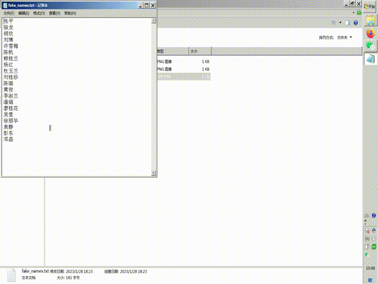

# WeKi

## 简介
WeKi 是使用 [AutoAHK v2](https://www.autohotkey.com/) 编写的简易自动化工具。目的是模拟人操作微信 PC 客户端。

名字 WeKi （基本上）由 Wechat Kit 缩略得到。

本项目与微信官方没有任何关系。

本项目不是利用 API 对微信操作，必须安装微信 PC 客户端。

## 已实现的功能
### 群发文字消息
1. 按下 Win + Shift + z 复制并处理转发列表
2. 按下 Win + Shift + a 输入要群发的文字消息并发送

转发列表是由换行符分隔的收信人名字，不必是全名，只要能搜到并唯一确定收信人即可。例子可见 [fake_names.txt](wechat_multi-forward_assets/fake_names.txt) 。这个例子的人名均为虚构，如有雷同纯属巧合。也可以复制 Excel 表格中含有人名的列。

### 半自动转发
1. 按下 Win + Shift + z 复制并处理转发列表
2. 选中一些消息，并准备转发它们（打开收信人窗口）
3. 按下 Win + Shift + x 执行转发

Limitation: 由于微信的图形界面限制一次转发最多转 9 个人，当转发人数多于 9 人时需要多次使用 Win + Shift + x 快捷键。
